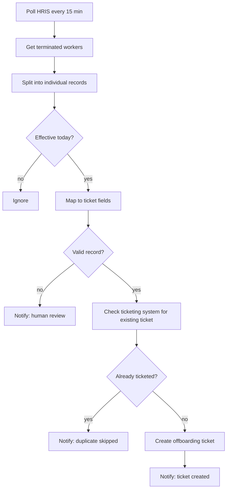

# HRIS Offboarding Ticket Automation

A reusable n8n workflow template that watches an HRIS for terminations and automatically opens
an offboarding ticket in your ticketing system, with deduplication, validation, and human
escalation built in.

Import `workflow-template.json` into n8n, point it at your systems, and adapt.

> **About this template.** This is a genericized version of a pattern I designed, built, and
> shipped to production in a live HR environment. All company systems, credentials, field
> mappings, and internal configuration have been removed and replaced with placeholders. It's
> the pattern and the reasoning, not anyone's instance.

## The Problem

When someone leaves, a chain of things has to happen: revoke access, recover equipment, notify
payroll and IT. In most companies that chain starts with a human noticing the termination and
remembering to open a ticket. Humans are busy, and offboarding is exactly the kind of task that
gets noticed late, which is a security problem as much as an HR one.

This workflow closes the gap between "HR marks someone terminated" and "the offboarding ticket
exists."

## The Pipeline

## Design Decisions

The interesting parts of this workflow aren't the API calls. They're the guardrails.

**Poll, don't wait for a webhook.** Many HRIS platforms don't emit a reliable termination event.
A 15-minute poll is well inside any reasonable offboarding SLA and doesn't depend on a webhook
that may never fire.

**Filter to "effective today" immediately.** Without this, every single poll would re-process
every historical termination in the system and re-notify forever. This one filter is the
difference between a working automation and a spam machine.

**Validate before creating anything.** A record missing an ID, an email, or a date produces a
broken ticket that a human then has to find and clean up. Instead, invalid records never become
tickets: they become a Slack message asking a person to look.

**Deduplicate with a tag, because polling guarantees repeats.** A scheduled workflow *will* see
the same termination more than once. Before creating a ticket, the workflow searches the
ticketing system for a tag built from the employee ID. If it's there, skip. This is what makes
the workflow idempotent, and it's the single most important design choice in the whole thing.

**Skip loudly, fail loudly.** A skipped duplicate still posts to Slack. An API failure after
retries still posts to Slack. Silent no-ops are how a team quietly stops trusting an automation.

**Leave the human fields to the human.** Things the HRIS can't know (equipment return method,
legal holds) are deliberately left blank for the assigned agent rather than guessed at by the
automation.

**Retries and timeouts on every external call.** Three retries with backoff, and a hard
execution timeout, so a transient API blip doesn't silently drop someone's offboarding.

## Setup

1. **Import the workflow.** In n8n: *Workflows → Import from File → `workflow-template.json`*
2. **Set these environment variables** (or swap the expressions for your own values):

   | Variable | What it is |
   |----------|------------|
   | `HRIS_API_BASE` | Base URL of your HRIS API |
   | `TICKETING_API_BASE` | Base URL of your ticketing system API |
   | `SLACK_CHANNEL_ID` | Channel for status notifications |

3. **Add credentials** in n8n's credential store for the HRIS and ticketing APIs. Never hardcode
   tokens into nodes.
4. **Adapt the field mapping.** The `Map Worker -> Ticket Fields` node flattens the HRIS response.
   Every HRIS nests its data differently, so this is the node you'll most likely need to edit.
5. **Test with the schedule disabled** before you publish. Then activate.

## Adapting It

The pattern is deliberately system-agnostic. It works with any HRIS that exposes terminations
over an API and any ticketing system that supports tags or a searchable custom field. The two
nodes to change are the HRIS `GET` and the ticket `POST`; everything between them (filter,
validate, dedupe, notify) is the reusable part.

## A Note on Scope

This workflow **creates a ticket**. It does not revoke access, disable accounts, or take any
destructive action. Those belong behind human approval, and deliberately so: an automation that
can lock someone out of their accounts on a bad data read is a much worse problem than one that
opens a ticket a human then works.

## Status

Production pattern, genericized. The original ran on a live HRIS with real terminations, passed
internal engineering review, and shipped.
